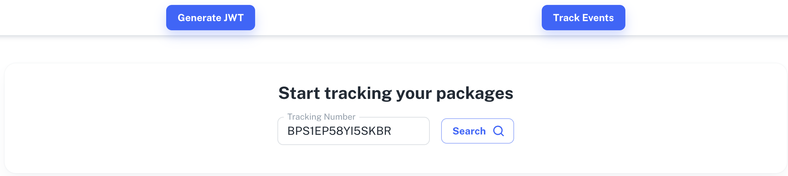

<h1 align="center">
 
  
 
Bringer Challenge App
</h1>

  

  

  

  

## Description

Application made for a Bringer Challenge

## Features

This app features all the latest tools and practices in web development!

- **React**
- **Typescript**
- **MUI**
- **ESlint/Prettier/Editor Config**
- **Axios**

## Getting started

1. Clone this repo using `https://github.com/pjavier98/bringer-challenge-app.git`
2. Move to the appropriate directory: `cd bringer-challenge-app`. 
3. Run `yarn` to install dependencies. 
4. Run `yarn start` to see the example app at `http://localhost:3000`.

## Contributing

Please read [CONTRIBUTING.md](CONTRIBUTING.md) for details on our code of conduct, and the process for submitting pull requests.
